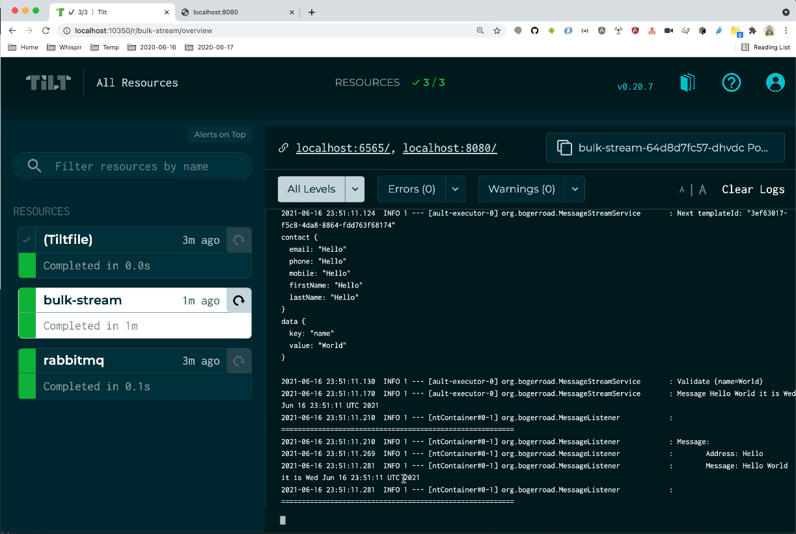

# bogerroad

## Introduction

This project will demonstrate using Tilt and Gradle to develop a Kotlin RabbitMQ Kafka Spring Boot application.  
The Spring Boot application will manage a [gRPC service](bulk-stream/src/main/proto/bulk.proto) that will accept a stream of contacts and add individual messages to [RabbitMQ](https://www.rabbitmq.com/).  The service may be invoked using [BloomRPC](https://github.com/uw-labs/bloomrpc).
The Docker image for the Spring Boot application will be built using the [Spring Boot Plugin](https://docs.spring.io/spring-boot/docs/2.5.0/gradle-plugin/reference/htmlsingle/) which will use CN Buildpacks to [Build the image](https://docs.spring.io/spring-boot/docs/2.5.0/gradle-plugin/reference/htmlsingle/#build-image)
The Application code is [Kotlin](https://kotlinlang.org/)

## Quickstart

```shell
brew install asdf

asdf plugin add java && \
  asdf install java graalvm-21.1.0+java11 && \
  asdf local java graalvm-21.1.0+java11
  
asdf plugin add tilt && \
  asdf install tilt 0.20.7 && \
  asdf local tilt 0.20.7

tilt up      
```

## Demonstration
[](https://youtu.be/768xOV5Ljj4?t=150)
